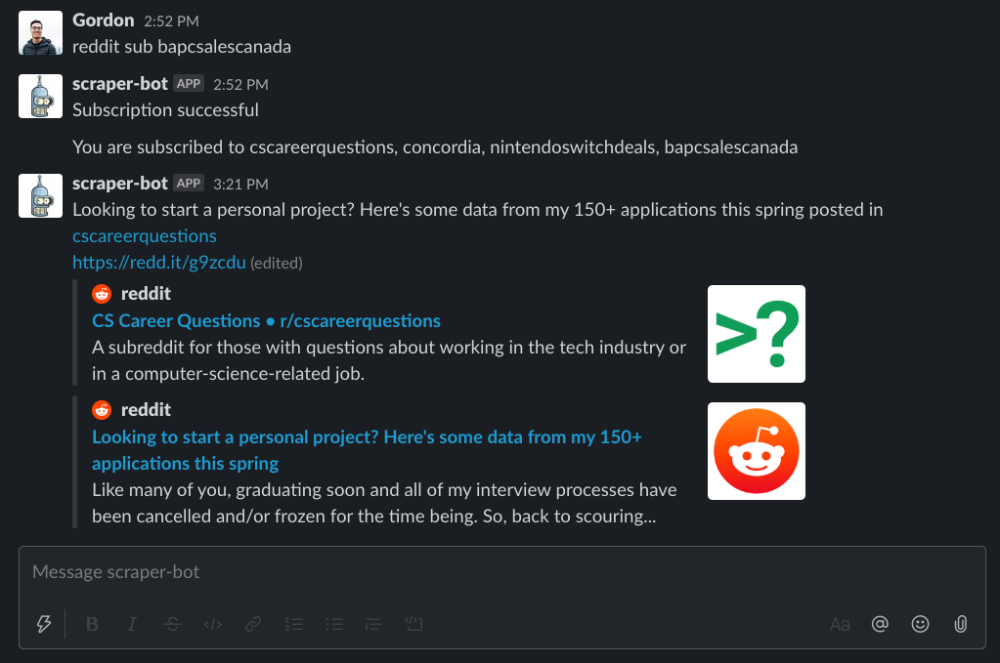

# Reddit Hot Posts Slack bot

## Motivation

I created this project because I wanted to be notified of hot new posts on select subreddits at a timely manner.

---

## Description

The project is split into two docker images, one is an API scraper and the other is the real-time slack bot.

First, the scraper gets data periodically from reddit and interacts only with the mongodb database.

Second, the real-time slack bot answers to commands to subscribe or unsubscribe to certain subreddits. As well as sending direct messages to the user about new hot posts.

## How It Works

My goal is to make the bot interactive as well as send the user real-time hot posts from Reddit.

Commands such as `reddit sub python` can be used to subscribe to /r/python. Likewise, `unsub` is the keyword to unsubscribe. To list the subreddits you are subscribed to, you can use `reddit subs`.

## Screenshot

## Prerequisites

You need:

- Bot user integration with your personal Slack workspace
- Reddit API account
- Docker and docker-compose installed

## Configuration

List of environment variables:

| Variable                   | Description                                                                               |
|----------------------------|-------------------------------------------------------------------------------------------|
| BOT_CHANNEL                | The direct message "channel" between you and the bot                                      |
| BOT_ID                     | The ID of the bot                                                                         |
| MONGO_COLLECTION           | The collection name where data from the scraper will be saved                             |
| MONGO_INITDB_DATABASE      | Name of the MongoDB database                                                              |
| MONGO_INITDB_ROOT_USERNAME | Root username to initialize MongoDB                                                       |
| MONGO_INITDB_ROOT_PASSWORD | Root password to initialize MongoDB                                                       |
| MONGO_NON_ROOT_PASSWORD    | The user password to use the database, we don't want to use the root user for these tasks |
| MONGO_NON_ROOT_USERNAME    | The user username to use the database                                                     |
| MONGO_SETTINGS             | A collection on the database to store settings                                            |
| REDDIT_CLIENT_ID           | The client ID to use the API                                                              |
| REDDIT_CLIENT_SECRET       | The secret that goes with the client ID above                                             |
| REDDIT_PASSWORD            | Password of the Reddit scraper bot                                                        |
| REDDIT_USERNAME            | Username of the Reddit scraper bot                                                        |
| SLACK_TOKEN                | Slack token needed for real-time messaging                                                |
| USER_ID                    | Your ID on the Slack workspace where this bot is being used                               |
| SCRAPER_HC_UUID            | Healthcheck UUID for scraper                                                              |
| SLACK_HC_UUID              | Healthcheck UUID for slack bot                                                            |

## Usage

Set the previously described environment variables and run `docker-compose up --detach`

## Roadmap

* [x]  Rewrite in Python
* [x]  Develop a Slack Bot to communicate the information
* [x]  Info on uptime
* [x]  Info on cpu load
* [x]  Refactor code to make more object-oriented
* [x]  watch all addresses feature
* [x]  load from external sources for addresses and jenkins url
* [x]  refactor for better code maintainability
* [x]  integrate personalized weather forecasting
* [x]  return Reddit news on demand only, instead of periodically
* [x]  Website monitoring feature
* [x]  Rewrite using Docker and simplify to one task (Reddit)

## Support

You may open an issue.

## License

[MIT License](./LICENSE)
